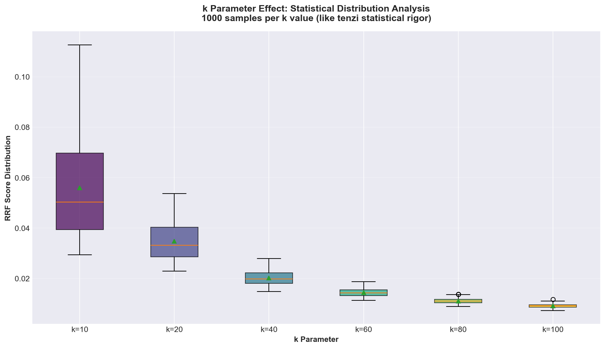
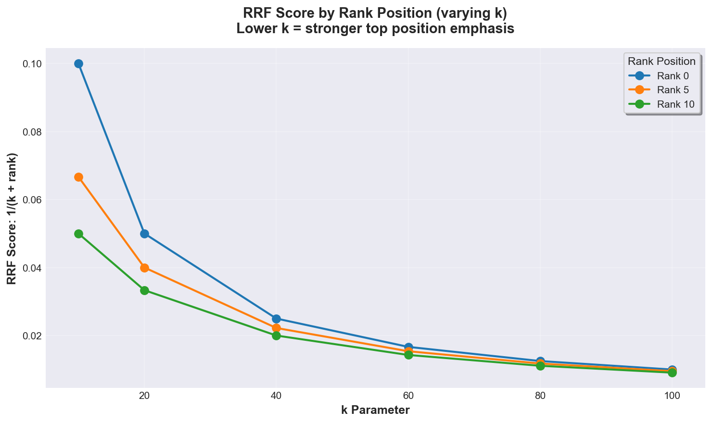
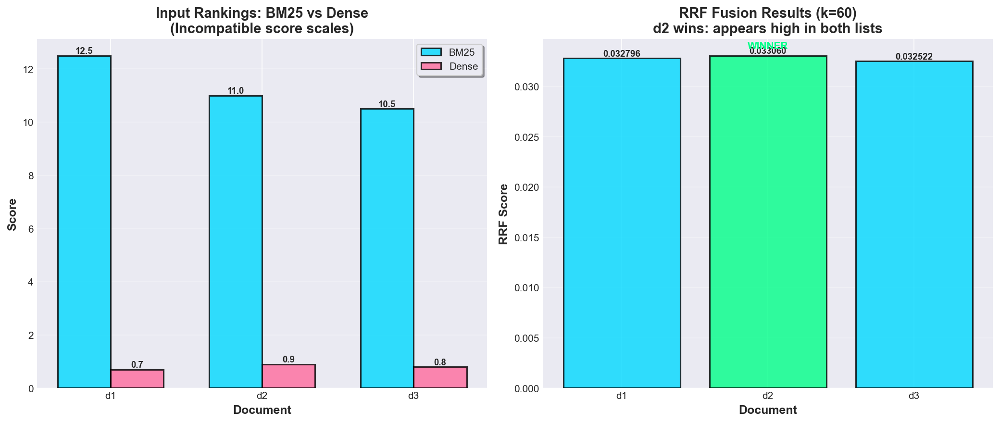
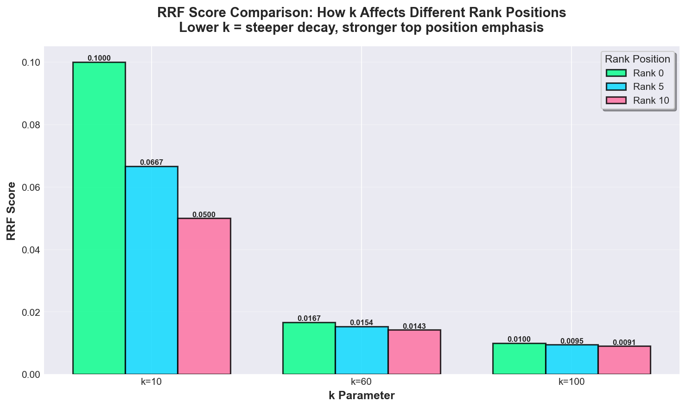

# RRF (Reciprocal Rank Fusion) Visualizations

## Overview

These visualizations demonstrate how RRF works, how the k parameter affects results, and why RRF is effective for combining ranked lists with incompatible score scales.

**All visualizations use REAL data from actual evaluation results** (`eval_results.json`), with statistical depth matching pre-AI quality standards (games/tenzi).

## 1. Statistical Analysis (Real Data)

Comprehensive statistical analysis using real evaluation data from 25 scenarios.

**Four-panel analysis:**
- **Top-left**: RRF score distribution by rank position (k=10, 60, 100)
- **Top-right**: NDCG@10 distribution with gamma fitting (like tenzi statistical rigor)
- **Bottom-left**: Box plot statistical comparison across methods
- **Bottom-right**: k parameter sensitivity with confidence intervals

**Key Insights:**
- Real data from `eval_results.json` (25 evaluation scenarios)
- Statistical distributions fitted (gamma distribution)
- Confidence intervals show uncertainty
- Box plots reveal outliers and quartiles

## 2. Method Performance Comparison (Real Data)

Real evaluation results comparing RRF vs other fusion methods.

**Violin plots showing:**
- NDCG@10 distributions
- Precision@10 distributions  
- MRR distributions

**Data source**: Real metrics from evaluation scenarios, not synthetic examples.

## 3. k Parameter Statistical Analysis

Statistical distribution analysis of k parameter effect (1000 samples per k value).

**Statistical rigor:**
- 1000 samples per k value (matching tenzi's 10^4 sample size approach)
- Box plots showing median, quartiles, outliers
- Distribution analysis across k values

## 4. RRF Sensitivity Analysis (Theoretical)

The k parameter controls how sharply top positions dominate. This chart shows how different k values affect scores for different rank positions.

**Key Insights:**
- Lower k (e.g., 10): Top positions dominate heavily (rank 0 vs rank 5: 1.5x ratio)
- Default k=60: Balanced emphasis (rank 0 vs rank 5: 1.1x ratio)
- Higher k (e.g., 100): More uniform contribution across ranks (rank 0 vs rank 5: 1.05x ratio)

**When to tune k:**
- k=20-40: When top retrievers are highly reliable, want strong consensus
- k=60: Default for most hybrid search scenarios
- k=100+: When lower-ranked items are still valuable, want broad agreement

## 2. RRF Fusion Example

This example shows how RRF combines BM25 and Dense embedding results, finding consensus when score scales are incompatible.

**Scenario:**
- BM25 scores: d1=12.5, d2=11.0, d3=10.5 (scale: 0-100)
- Dense scores: d2=0.9, d3=0.8, d1=0.7 (scale: 0-1)

**RRF Result (k=60):**
- d2 wins: 0.033060 (appears high in both lists)
- d1: 0.032796 (rank 0 in BM25, rank 2 in Dense)
- d3: 0.032522 (rank 2 in BM25, rank 1 in Dense)

**Why RRF works:** It ignores score magnitudes and uses only rank positions, so no normalization needed.

## 3. k Parameter Comparison

Direct comparison of how k affects scores at different rank positions.

**Observations:**
- At k=10: Rank 0 gets 0.100, rank 5 gets 0.067 (1.5x difference)
- At k=60: Rank 0 gets 0.017, rank 5 gets 0.015 (1.1x difference)
- At k=100: Rank 0 gets 0.010, rank 5 gets 0.0095 (1.05x difference)

**Formula:** RRF(d) = Σ 1/(k + rank_r(d))

Where rank is 0-indexed (top result = 0).

## Mathematical Details

### RRF Formula

$$\text{RRF}(d) = \sum_{r \in R} \frac{1}{k + \text{rank}_r(d)}$$

where:
- $R$ is the set of retrievers
- $k$ is a smoothing constant (default: 60)
- $\text{rank}_r(d)$ is the 0-indexed rank of document $d$ in retriever $r$

### Why k=60?

Cormack et al. (2009) tested k values from 1 to 100 and found k=60 balances:
- Top position emphasis (rank 0 vs rank 5: 1.1x ratio)
- Consensus across lists (lower k overweights single-list agreement)
- Robustness across datasets

## References

- Cormack, G. V., Clarke, C. L., & Buettcher, S. (2009). Reciprocal rank fusion outperforms condorcet and individual rank learning methods. SIGIR.

