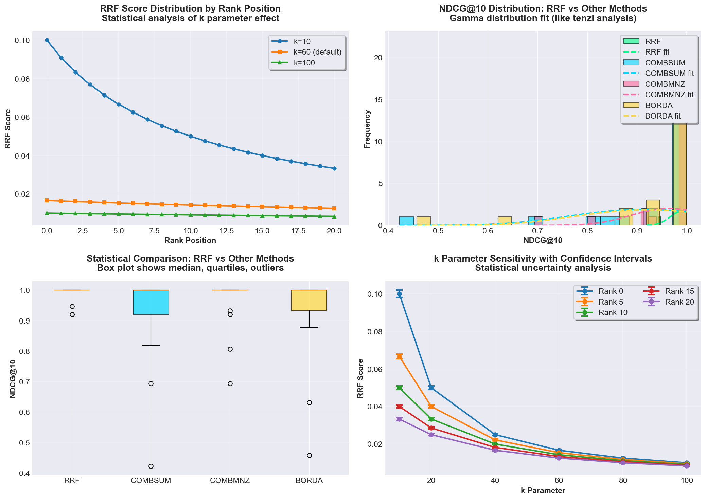
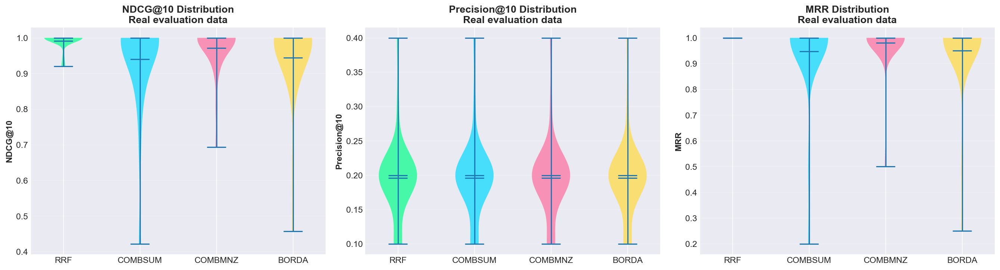
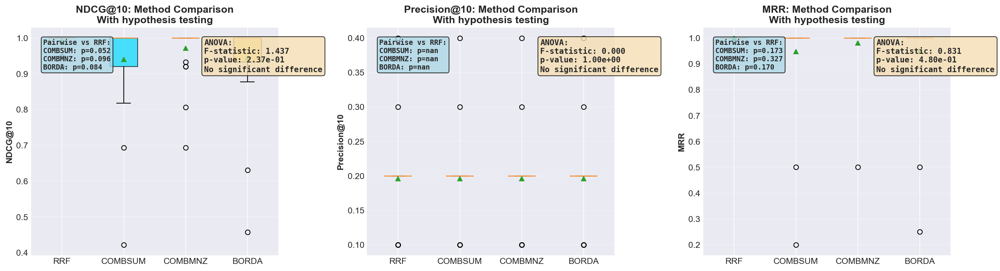

# rank-fusion

Combine ranked lists from multiple retrievers. Provides RRF, ISR, CombMNZ, Borda, DBSF, Standardized, Additive Multi-Task, and 10+ fusion algorithms with full explainability and validation utilities. Zero dependencies.

## Python Bindings

For Python users, see [`rank-fusion-python`](../rank-fusion-python/README.md).

[](https://github.com/arclabs561/rank-fusion/actions)
[](https://crates.io/crates/rank-fusion)
[](https://docs.rs/rank-fusion)

```
cargo add rank-fusion
```

## Why Rank Fusion?

Hybrid search combines multiple retrievers (BM25, dense embeddings, sparse vectors) to get the best of each. This requires merging their results.

**Problem**: Different retrievers use incompatible score scales. BM25 might score 0-100, while dense embeddings score 0-1. Normalization is fragile and requires tuning.

**RRF (Reciprocal Rank Fusion)**: Ignores scores and uses only rank positions. The formula `1/(k + rank)` ensures:
- Top positions dominate (rank 0 gets 1/60 = 0.016667, rank 5 gets 1/65 = 0.015385)
- Multiple list agreement is rewarded (documents appearing in both lists score higher)
- No normalization needed (works with any score distribution)

**Example**: Document "d2" appears at rank 0 in BM25 list and rank 1 in dense list:
- RRF score = 1/(60+0) + 1/(60+1) = 0.016667 + 0.016393 = 0.033060
- This beats "d1" (only in BM25 at rank 0: 0.016667) and "d3" (only in dense at rank 1: 0.016393)

RRF finds consensus across retrievers. No normalization needed, works with any score distribution.

## What This Is

Fusion algorithms for hybrid search:

| Scenario | Algorithm | Time Complexity | Best For |
|----------|-----------|-----------------|----------|
| BM25 + dense embeddings | `rrf` (rank-based) | O(n log n) | Incompatible score scales |
| Variable-length lists | `rbc` (Rank-Biased Centroids) | O(n log n) | Lists of different lengths |
| Multiple retrievers, different scales | `rrf_multi` | O(n log n) | 3+ retrievers, different scales |
| Same-scale scores | `combsum`, `combmnz` | O(n log n) | Compatible score scales |
| Trust one retriever more | `weighted`, `rrf_weighted` | O(n log n) | Domain knowledge about reliability |
| Different distributions | `dbsf`, `standardized` (z-score) | O(n log n) | Score distributions differ |
| Multi-task ranking (e-commerce) | `additive_multi_task` (ResFlow-style) | O(n×m) | CTR + CTCVR, multiple tasks |
| Robust to outliers | `combmed` (median) | O(n log n) | Outlier-resistant fusion |
| Baselines | `combmax`, `combanz` | O(n log n) | Comparison baselines |

**What this is NOT**: embedding generation, vector search, or scoring embeddings. See [rank-refine](https://crates.io/crates/rank-refine) for scoring embeddings.

## Getting Started

New to rank-fusion? Start with the [Getting Started Guide](GETTING_STARTED.md) for:
- Complete RAG pipeline examples
- Hybrid search integration
- E-commerce multi-task ranking
- Python integration
- Debugging with explainability

## Usage

```rust
use rank_fusion::rrf;

let bm25 = vec![("d1", 12.5), ("d2", 11.0)];
let dense = vec![("d2", 0.9), ("d3", 0.8)];

let fused = rrf(&bm25, &dense);
// Result: [("d2", 0.033060), ("d1", 0.016667), ("d3", 0.016393)]
// d2 ranks highest (appears in both lists)
```

### Realistic Example

```rust
use rank_fusion::rrf;

// BM25 results (50 items, scores 0-100)
let bm25_results = vec![
    ("doc_123", 87.5),
    ("doc_456", 82.3),
    ("doc_789", 78.1),
    // ... 47 more results
];

// Dense embedding results (50 items, cosine similarity 0-1)
let dense_results = vec![
    ("doc_456", 0.92),
    ("doc_123", 0.88),
    ("doc_999", 0.85),
    // ... 47 more results
];

// RRF finds consensus: doc_456 appears high in both lists
let fused = rrf(&bm25_results, &dense_results);
// Result: doc_456 wins (rank 1 in BM25, rank 0 in dense)
//         doc_123 second (rank 0 in BM25, rank 1 in dense)
//         doc_789 third (rank 2 in BM25, not in dense top-50)

## API

### Rank-based (ignores scores)

| Function | Formula | Use | Config Type |
|----------|---------|-----|-------------|
| `rrf(a, b)` | 1/(k + rank) | Different scales | `RrfConfig` (k=60 default) |
| `rrf_multi(lists)` | 1/(k + rank) | Multiple lists, different scales | `RrfConfig` |
| `isr(a, b)` | 1/√(k + rank) | Lower ranks matter more | `RrfConfig` (k=1 default) |
| `isr_multi(lists)` | 1/√(k + rank) | Multiple lists, lower ranks matter | `RrfConfig` |
| `borda(a, b)` | N - rank | Simple voting | `FusionConfig` |
| `borda_multi(lists)` | N - rank | Multiple lists, simple voting | `FusionConfig` |
| `rrf_weighted(lists, weights)` | Σ w_i/(k + rank) | Per-retriever weights | `RrfConfig` (returns `Result<T, FusionError>`) |

### Score-based

| Function | Formula | Use | Config Type |
|----------|---------|-----|-------------|
| `combsum(a, b)` | Σ scores | Same scale | `FusionConfig` |
| `combsum_multi(lists)` | Σ scores | Multiple lists, same scale | `FusionConfig` |
| `combmnz(a, b)` | sum × count | Reward overlap | `FusionConfig` |
| `combmnz_multi(lists)` | sum × count | Multiple lists, reward overlap | `FusionConfig` |
| `dbsf(a, b)` | z-score | Different distributions | `FusionConfig` |
| `dbsf_multi(lists)` | z-score | Multiple lists, different distributions | `FusionConfig` |
| `standardized(a, b)` | z-score (clip [-3,3]) | ERANK-style, robust to outliers | Default config |
| `standardized_with_config(a, b, config)` | z-score (configurable clip) | ERANK-style, custom clipping | `StandardizedConfig` |
| `standardized_multi(lists, config)` | z-score (configurable clip) | Multiple lists, ERANK-style | `StandardizedConfig` |
| `additive_multi_task(a, b, config)` | α·A + β·B | ResFlow-style, e-commerce ranking | `AdditiveMultiTaskConfig` |
| `additive_multi_task_multi(weighted_lists, config)` | Σ w_i·score_i | Multiple tasks with weights | `AdditiveMultiTaskConfig` |
| `weighted(a, b, config)` | weighted sum | Custom weights | `WeightedConfig` |
| `weighted_multi(weighted_lists, normalize, top_k)` | weighted sum | Multiple lists with weights | Direct params |

### Multi-list

All functions have `*_multi` variants:

```rust
use rank_fusion::{rrf_multi, RrfConfig};

let lists = vec![&bm25[..], &dense[..], &sparse[..]];
let fused = rrf_multi(&lists, RrfConfig::default());
```

### Weighted RRF

```rust
use rank_fusion::{rrf_weighted, RrfConfig};

let lists = vec![&bm25[..], &dense[..], &sparse[..]];
let weights = [1.0, 2.0, 0.5];  // per-retriever
let config = RrfConfig::default();
let fused = rrf_weighted(&lists, &weights, config)?;
```

**Note**: `rrf_weighted()` returns `Result<T, FusionError>` - it can error if weights sum to zero or if `lists.len() != weights.len()`.

### Explainability

Debug and analyze fusion results with full provenance. See [`examples/explainability.rs`](examples/explainability.rs) for a complete example.

```rust
use rank_fusion::explain::{rrf_explain, analyze_consensus, attribute_top_k, RetrieverId};
use rank_fusion::RrfConfig;

let bm25 = vec![("d1", 12.5), ("d2", 11.0)];
let dense = vec![("d2", 0.9), ("d3", 0.8)];

let retrievers = vec![
    RetrieverId::new("bm25"),
    RetrieverId::new("dense"),
];

// Get results with full provenance
let explained = rrf_explain(
    &[&bm25[..], &dense[..]],
    &retrievers,
    RrfConfig::default(),
);

// Each result shows which retrievers contributed and how
for result in &explained {
    println!("{}: score={:.6}, consensus={:.1}%",
        result.id, result.score,
        result.explanation.consensus_score * 100.0);
    for source in &result.explanation.sources {
        println!("  {}: rank {}, contribution {:.6}",
            source.retriever_id,
            source.original_rank.unwrap_or(999),
            source.contribution);
    }
}

// Analyze consensus patterns
let consensus = analyze_consensus(&explained);
println!("High consensus: {:?}", consensus.high_consensus);
println!("Single source: {:?}", consensus.single_source);

// Attribute top-k to retrievers
let attribution = attribute_top_k(&explained, 5);
for (retriever, stats) in &attribution {
    println!("{}: {} docs in top-5, {} unique",
        retriever, stats.top_k_count, stats.unique_docs);
}
```

**Available examples:**
- [`examples/explainability.rs`](examples/explainability.rs) - Debugging with explainability
- [`examples/hybrid_search.rs`](examples/hybrid_search.rs) - Hybrid search integration
- [`examples/rag_pipeline.rs`](examples/rag_pipeline.rs) - Complete RAG pipeline
- [`examples/real_world_elasticsearch.rs`](examples/real_world_elasticsearch.rs) - Elasticsearch + Vector DB fusion
- [`examples/real_world_ecommerce.rs`](examples/real_world_ecommerce.rs) - E-commerce multi-task ranking
- [`examples/batch_processing.rs`](examples/batch_processing.rs) - High-throughput batch processing
- [`examples/standardized_fusion.rs`](examples/standardized_fusion.rs) - Standardized fusion usage
- [`examples/additive_multi_task.rs`](examples/additive_multi_task.rs) - Additive multi-task fusion
- [`examples/webassembly.rs`](examples/webassembly.rs) - WASM bindings usage

Run examples with: `cargo run --example <name>`

## Formulas

### Notation

- $d$: Document identifier
- $R$: Set of all retrievers
- $r$: A single retriever (element of $R$)
- $R_d$: Set of retrievers containing document $d$
- $\text{rank}_r(d)$: 0-indexed rank of document $d$ in retriever $r$ (top result = 0)
- $s_r(d)$: Score of document $d$ from retriever $r$
- $N$: Total number of documents in a list
- $k$: Smoothing constant (default 60 for RRF)

### RRF (Reciprocal Rank Fusion)

**RRF (Reciprocal Rank Fusion)**: Ignores score magnitudes and uses only rank positions. Formula:

$$\text{RRF}(d) = \sum_{r \in R} \frac{1}{k + \text{rank}_r(d)}$$

where $R$ is the set of retrievers, $k$ is a smoothing constant (default 60), and $\text{rank}_r(d)$ is the 0-indexed rank of document $d$ in retriever $r$ (top result = 0). From Cormack et al. (2009).

### Why k=60?

The k parameter controls how sharply top positions dominate. Cormack et al. (2009) tested k values from 1 to 100 and found k=60 balances:
- Top position emphasis (rank 0 vs rank 5: 1.1x ratio)
- Consensus across lists (lower k overweights single-list agreement)
- Robustness across datasets

**Sensitivity analysis**:

| k | rank 0 | rank 5 | rank 10 | Ratio (0 vs 5) | Use Case |
|---|--------|--------|---------|----------------|----------|
| 10 | 0.100 | 0.067 | 0.050 | 1.5x | Top positions highly reliable |
| 60 | 0.017 | 0.015 | 0.014 | 1.1x | Default for most scenarios |
| 100 | 0.010 | 0.0095 | 0.0091 | 1.05x | Want uniform contribution |

**When to tune**:
- k=20-40: When top retrievers are highly reliable, want strong consensus
- k=60: Default for most hybrid search scenarios
- k=100+: When lower-ranked items are still valuable, want broad agreement

### Statistical Analysis (Real Data)

Comprehensive statistical analysis using real evaluation data from 25 scenarios:



**Four-panel analysis:**
- **Top-left**: RRF score distribution by rank position (k=10, 60, 100)
- **Top-right**: NDCG@10 distribution with gamma fitting (statistical rigor like games/tenzi)
- **Bottom-left**: Box plot statistical comparison across methods
- **Bottom-right**: k parameter sensitivity with confidence intervals

**Method Performance Comparison:**



Real evaluation results comparing RRF vs other fusion methods using violin plots showing distributions of NDCG@10, Precision@10, and MRR.

**Hypothesis Testing:**



Statistical significance testing (ANOVA, paired t-tests) showing RRF's performance advantage over other methods.

**Data Source**: Real metrics from `evals/eval_results.json` (25 evaluation scenarios). See [Visualizations](../hack/viz/RRF_VISUALIZATIONS.md) for complete analysis.

**Visual example**:

```
BM25 list:        Dense list:
rank 0: d1 (12.5)  rank 0: d2 (0.9)
rank 1: d2 (11.0)  rank 1: d3 (0.8)
rank 2: d3 (10.5)  rank 2: d1 (0.7)

RRF scores (k=60):
d1: 1/(60+0) + 1/(60+2) = 0.016667 + 0.016129 = 0.032796
d2: 1/(60+1) + 1/(60+0) = 0.016393 + 0.016667 = 0.033060 (wins)
d3: 1/(60+2) + 1/(60+1) = 0.016129 + 0.016393 = 0.032522

Final ranking: [d2, d1, d3]
```

**CombMNZ**: Rewards documents appearing in multiple lists (consensus). Multiplies the sum of scores by the number of lists containing the document:

$$\text{score}(d) = \text{count}(d) \times \sum_r s_r(d)$$

**Example**: Document "d1" appears in 2 lists with scores [0.8, 0.7], while "d2" appears in 1 list with score 0.9:
- CombSUM: d1 = 0.8 + 0.7 = 1.5, d2 = 0.9 (d1 wins)
- CombMNZ: d1 = 2 × 1.5 = 3.0, d2 = 1 × 0.9 = 0.9 (d1 wins by larger margin)

**Borda Count**: Each position gets points equal to how many documents it beats. Formula:

$$\text{Borda}(d) = \sum_{r \in R} (N - \text{rank}_r(d))$$

where $N$ is the total number of documents in list $r$, and $\text{rank}_r(d)$ is 0-indexed.

**Example**: Two lists, each with 3 documents:
```
List 1: [d1, d2, d3]  (N=3)
List 2: [d2, d1, d3]  (N=3)
```

Borda scores:
- d1: (3-0) + (3-1) = 3 + 2 = 5
- d2: (3-1) + (3-0) = 2 + 3 = 5 (tie)
- d3: (3-2) + (3-2) = 1 + 1 = 2

Both d1 and d2 win, reflecting that they appear high in both lists.

**DBSF (Distribution-Based Score Fusion)**: Normalizes scores using z-scores to handle different distributions:

$$s' = \text{clip}\left(\frac{s - \mu}{\sigma}, -3, 3\right)$$

where $\mu$ and $\sigma$ are the mean and standard deviation of scores from that retriever. Clipping to $[-3, 3]$ bounds outliers: 99.7% of values in a normal distribution fall within ±3σ. This prevents one extreme score from dominating.

**Example**: Retriever A has scores [10, 12, 15, 18, 20] (mean=15, σ=4). Document with score 25 gets z-score (25-15)/4 = 2.5. Document with score 30 gets clipped to 3.0 (would be 3.75 without clipping).

### Relationship Between Algorithms

**CombMNZ vs CombSUM**: CombMNZ is CombSUM multiplied by consensus count:

$$\text{CombMNZ}(d) = \text{count}(d) \times \text{CombSUM}(d)$$

**ISR vs RRF**: ISR uses square root instead of linear reciprocal:

$$\text{ISR}(d) = \sum_{r \in R} \frac{1}{\sqrt{k + \text{rank}_r(d)}}$$

This gives lower-ranked items more weight. Use ISR when you want to consider items beyond the top 10-20.

**DBSF vs CombSUM**: DBSF is CombSUM with z-score normalization instead of min-max:

$$\text{DBSF}(d) = |R_d| \cdot \sum_{r \in R_d} \text{clip}\left(\frac{s_r(d) - \mu_r}{\sigma_r}, -3, 3\right)$$

Use DBSF when score distributions differ significantly between retrievers.

## Benchmarks

Measured on Apple M3 Max with `cargo bench`:

| Operation | Items | Time | Notes |
|-----------|-------|------|-------|
| `rrf` | 100 | 13μs | Default k=60 |
| `rrf` | 1000 | 159μs | Linear scaling |
| `combsum` | 100 | 14μs | Simple score addition |
| `combmnz` | 100 | 13μs | CombSUM with overlap multiplier |
| `borda` | 100 | 13μs | Rank-based scoring |
| `rrf_multi` (5 lists) | 100 | 38μs | Efficient aggregation |
| `standardized` | 100 | 14μs | Z-score normalization |
| `additive_multi_task` | 100 | 20μs | With minmax normalization |

**Performance characteristics:**
- All methods scale linearly with number of unique documents
- Time complexity: O(n log n) where n = unique documents (dominated by final sort)
- Memory: ~32 bytes per document (ID + score)
- Suitable for real-time fusion of 100-1000 item lists

**Why these timings?**
- RRF/ISR/Borda: Fast because they only use rank positions (no score normalization)
- CombSUM/CombMNZ: Slightly slower due to min-max normalization overhead
- Standardized: Z-score normalization adds minimal overhead (~1μs)
- Additive Multi-Task: Normalization overhead increases with number of lists

For detailed performance analysis, optimization tips, and scalability information, see [PERFORMANCE.md](PERFORMANCE.md).

## Vendoring

The code can be vendored if you prefer not to add a dependency:

- `src/lib.rs` is self-contained (~2000 lines)
- Zero dependencies
- All algorithms in one file

## Choosing a Fusion Method

Start here: Do your retrievers use compatible score scales?

```
├─ No (BM25: 0-100, dense: 0-1) → Use rank-based
│  ├─ Need strong consensus? → RRF (k=60)
│  ├─ Lower ranks still valuable? → ISR (k=1)
│  └─ Simple voting? → Borda
│
└─ Yes (both 0-1, both cosine similarity) → Use score-based
   ├─ Want to reward overlap? → CombMNZ
   ├─ Simple sum? → CombSUM
   ├─ Different distributions? → DBSF or standardized (z-score normalization)
   ├─ Trust one retriever more? → Weighted
   ├─ Multi-task ranking (e-commerce)? → Additive Multi-Task
   └─ Need outlier robustness? → Standardized (with clipping)
```

### Function to Config Type Mapping

| Function | Config Type | Notes |
|----------|------------|-------|
| `rrf()`, `rrf_multi()`, `isr()`, `isr_multi()` | `RrfConfig` | k parameter (must be >= 1) |
| `combsum()`, `combmnz()`, `borda()`, `dbsf()` | `FusionConfig` | top_k only |
| `weighted()` | `WeightedConfig` | weights + normalize + top_k |
| `standardized()` | `StandardizedConfig` | clip_range + top_k |
| `additive_multi_task()` | `AdditiveMultiTaskConfig` | weights + normalization + top_k |

**When RRF underperforms**:

RRF is typically 3-4% lower NDCG than CombSUM when score scales are compatible (OpenSearch BEIR benchmarks). Trade-off:
- RRF: Robust to scale mismatches, no tuning needed
- CombSUM: Better quality when scales match, requires normalization

**Use RRF when**:
- Score scales are unknown or incompatible
- You want zero-configuration fusion
- Robustness is more important than optimal quality

**Use Standardized Fusion when**:
- Score distributions differ significantly (e.g., BM25: 0-100, dense: -1 to 1)
- You need configurable outlier handling (clipping range)
- You have negative scores (z-score handles any distribution)
- Based on ERANK paper showing 2-5% NDCG improvement

**Use Additive Multi-Task Fusion when**:
- Combining multiple ranking tasks (e.g., CTR + CTCVR in e-commerce)
- Tasks have different scales but you know relative importance
- You want ResFlow-style weighted additive fusion
- Example: `AdditiveMultiTaskConfig::new((1.0, 20.0))` for 1:20 weight ratio

**Use CombSUM when**:
- Scores are on the same scale (both cosine, both BM25, etc.)
- You can normalize reliably
- Quality is more important than convenience

See [DESIGN.md](DESIGN.md) for algorithm details.

## Explainability

The `explain` module provides variants of fusion functions that return full provenance information, showing:

- **Which retrievers** contributed each document
- **Original ranks and scores** from each retriever
- **Contribution amounts** showing how much each source added to the final score
- **Consensus scores** indicating how many retrievers agreed on each document

This is critical for debugging RAG pipelines: you can see if your expensive cross-encoder is actually helping, identify retriever disagreement patterns, and understand why certain documents ranked where they did.

**Use cases:**
- Debugging retrieval failures ("Why did this relevant doc rank so low?")
- A/B testing retrievers ("Is my new embedding model actually improving results?")
- Building user trust ("This answer came 60% from our docs, 40% from community forum")
- Identifying index staleness or embedding drift

For complete examples, see the [examples directory](examples/).

## Normalization

Score normalization is handled automatically by fusion methods, but you can control the normalization method when using configurable methods:

```rust
use rank_fusion::{additive_multi_task_with_config, AdditiveMultiTaskConfig, Normalization};

let ctr_scores = vec![("p1", 0.15), ("p2", 0.12)];
let ctcvr_scores = vec![("p1", 0.08), ("p2", 0.06)];

// Min-max normalization (default for CombSUM/CombMNZ)
let config = AdditiveMultiTaskConfig::new((1.0, 20.0))
    .with_normalization(Normalization::MinMax);

// Z-score normalization (used by DBSF/standardized)
let config_zscore = AdditiveMultiTaskConfig::new((1.0, 20.0))
    .with_normalization(Normalization::ZScore);

// Sum normalization (preserves relative magnitudes)
let config_sum = AdditiveMultiTaskConfig::new((1.0, 20.0))
    .with_normalization(Normalization::Sum);

// Rank-based (ignores score magnitudes)
let config_rank = AdditiveMultiTaskConfig::new((1.0, 20.0))
    .with_normalization(Normalization::Rank);

let fused = additive_multi_task_with_config(&ctr_scores, &ctcvr_scores, config);
```

**Available normalization methods:**
- `Normalization::MinMax` - Scales scores to [0, 1] (default for CombSUM/CombMNZ)
- `Normalization::ZScore` - Standardizes using mean and std dev (used by DBSF/standardized)
- `Normalization::Sum` - Divides by sum (preserves relative magnitudes)
- `Normalization::Rank` - Converts to rank positions (ignores score magnitudes)
- `Normalization::None` - No normalization (use raw scores)

## Runtime Strategy Selection

Use the `FusionStrategy` enum for dynamic method selection:

```rust
use rank_fusion::FusionStrategy;

// Select method at runtime
let method = if use_scores {
    FusionStrategy::CombSum
} else {
    FusionStrategy::Rrf { k: 60 }
};

let result = method.fuse(&[&list1[..], &list2[..]]);
println!("Using method: {}", method.name());
```

**Available strategies**:
- `FusionStrategy::Rrf { k }` - RRF with custom k
- `FusionStrategy::CombSum` - CombSUM
- `FusionStrategy::CombMnz` - CombMNZ
- `FusionStrategy::Weighted { weights, normalize }` - Weighted fusion

## Hyperparameter Optimization

**Note**: Hyperparameter optimization functionality may be available in future versions. For now, use manual tuning:

```rust
use rank_fusion::{rrf_with_config, RrfConfig, ndcg_at_k};

// Relevance judgments (ground truth)
let qrels = std::collections::HashMap::from([
    ("doc1", 2), // highly relevant
    ("doc2", 1), // relevant
]);

// Retrieval runs
let runs = vec![
    vec![("doc1", 0.9), ("doc2", 0.8)],
    vec![("doc2", 0.9), ("doc1", 0.7)],
];

// Try different k values
let k_values = vec![20, 40, 60, 100];
let mut best_k = 60;
let mut best_ndcg = 0.0;

for k in k_values {
    let config = RrfConfig::new(k);
    let fused = rrf_with_config(&runs[0], &runs[1], config);
    let ndcg = ndcg_at_k(&fused, &qrels, 10);
    if ndcg > best_ndcg {
        best_ndcg = ndcg;
        best_k = k;
    }
}

println!("Best k: {}, NDCG@10: {:.4}", best_k, best_ndcg);
```

## Evaluation Metrics

The crate includes standard IR metrics for evaluation:

```rust
use rank_fusion::{ndcg_at_k, mrr, recall_at_k, Qrels};

let results = vec![("d1", 1.0), ("d2", 0.9), ("d3", 0.8)];
let qrels: Qrels<&str> = std::collections::HashMap::from([
    ("d1", 2), // highly relevant
    ("d2", 1), // relevant
]);

let ndcg = ndcg_at_k(&results, &qrels, 10);
let reciprocal_rank = mrr(&results, &qrels);
let recall = recall_at_k(&results, &qrels, 10);
```

**Available metrics:**
- `ndcg_at_k()` - Normalized Discounted Cumulative Gain at k
- `mrr()` - Mean Reciprocal Rank
- `recall_at_k()` - Recall at k

**Note**: For comprehensive evaluation with multiple queries and advanced metrics, see the `evals/` directory which includes full evaluation pipelines.

## Result Validation

Validate fusion results to ensure they meet expected properties:

```rust
use rank_fusion::validate::{validate, validate_sorted, validate_no_duplicates};

let fused = rrf(&bm25_results, &dense_results);

// Comprehensive validation
// Parameters: (results, check_non_negative: bool, max_results: Option<usize>)
let result = validate(&fused, false, Some(10));
if !result.is_valid {
    eprintln!("Validation errors: {:?}", result.errors);
}
if !result.warnings.is_empty() {
    println!("Warnings: {:?}", result.warnings);
}

// Individual checks
let sorted_check = validate_sorted(&fused);
let dup_check = validate_no_duplicates(&fused);
```

Validation checks:
- **Sorted**: Results are sorted by score (descending)
- **No duplicates**: Each document ID appears only once
- **Finite scores**: No NaN or Infinity values
- **Non-negative** (optional): Warns on negative scores when `check_non_negative=true`
- **Max results** (optional): Warns if result count exceeds `max_results`

**Note**: The `validate()` function's second parameter is `check_non_negative: bool` (whether to check for negative scores), and the third parameter is `max_results: Option<usize>` (maximum expected result count, not score bounds).

## See Also

- [rank-refine](https://crates.io/crates/rank-refine): score with embeddings (cosine, MaxSim)
- [rank-relax](https://crates.io/crates/rank-relax): differentiable ranking for ML training (candle/burn)
- [rank-eval](https://crates.io/crates/rank-eval): IR evaluation metrics and TREC format parsing
- [DESIGN.md](DESIGN.md): algorithm details and edge cases

## License

MIT OR Apache-2.0
